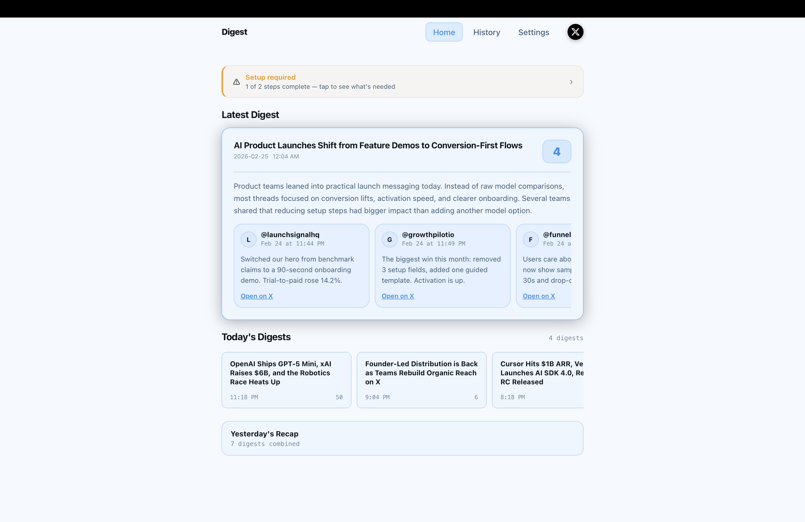
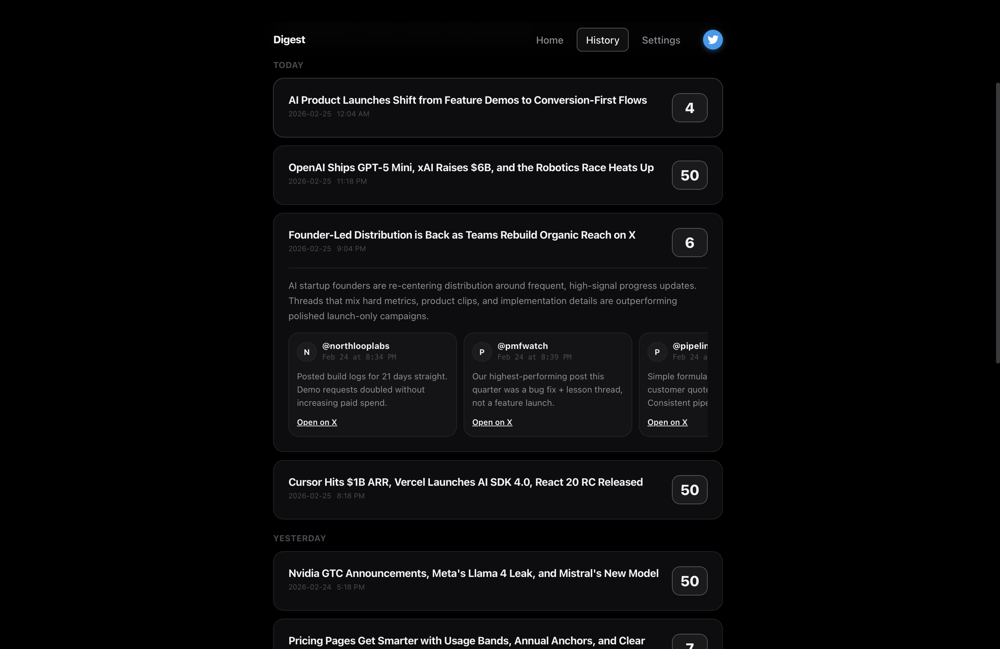
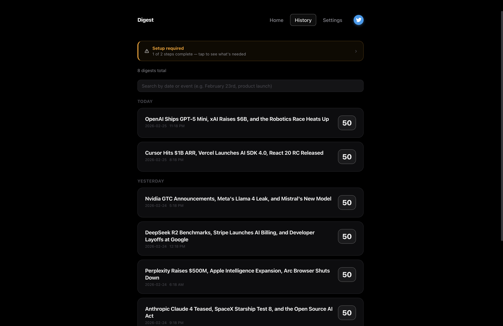

Twitter Digest is a single-app platform that ingests tweets, deduplicates updates, and publishes structured digests.
It provides live digest views, history browsing, and API endpoints for ingestion and retrieval.

## Features
- Ingest tweets from X API or external worker mode
- Deduplicate tweets by ID across batches
- Generate digest summaries with configurable AI providers
- Store digests and tweet links in Postgres
- Browse latest digest and full searchable history
- Trigger scheduled digest runs via cron endpoint

## Pics

## Tech Stack

